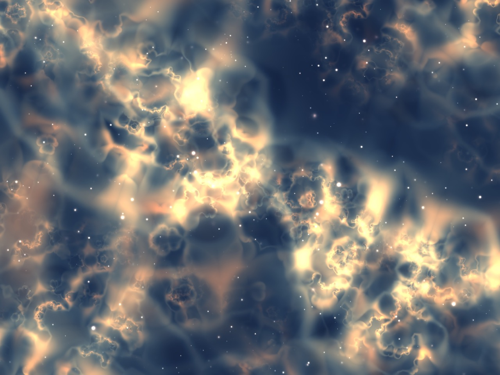

# Nebula
Core Image Volumetric Rendering 

I'd love to be able to take credit for this shader, but the hard work isn't mine! This volumetric nebula shader code originates from [glslsandbox.com](http://glslsandbox.com/e#31308.0) . All I've done is changed `main()` to a kernel function, swapped out `gl_FragCoord` for `destCoord` and wrapped the code in a `CIColorKernel`.

On my iPad Pro, I get around 30fps rendering at 2732 x 2048 - not too bad!
